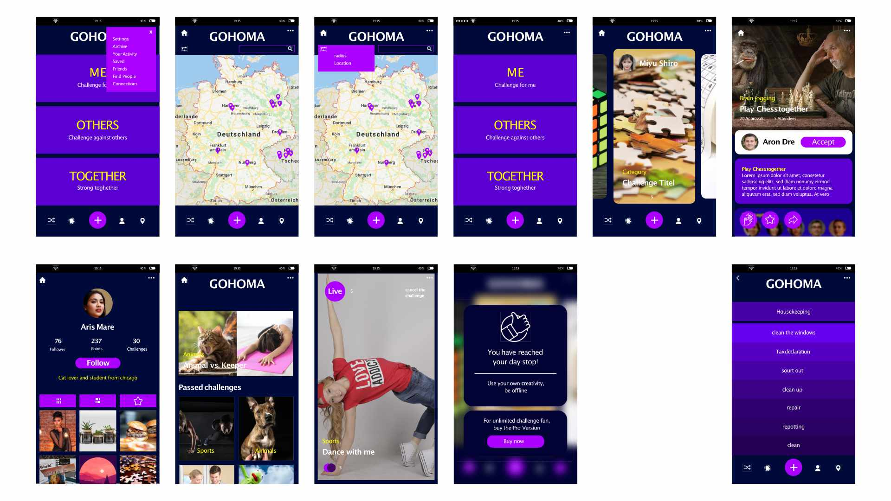

# GOHOMA

This prototype is a web-application to motivate housebound people to solve challenges against oneanother.

## Details
When people have to stay in a small place they tend to become listless and sluggish.
To interrupt this lethargy the user will be activated to solve challenges against themselves, friends and others.

### Mockups

### Contributers:

Katja Barck  
Maren Engelke  
[Lena Flottow](https://www.behance.net/Flottow_design)  
Sabrina Gehrke  
Johannes Hauenschild  
Nicole Heinze  
Lars Kaiser  
[Philipp Renerig](mailto:philipp@renerig.de)  
David Redlich (dre)  
Christian Waltjen  
Jana Wessely  

### Special Thanks:
[Sascha Krüger](https://www.saschakrueger.de/)

This Project based on: [Hackathon Starter](https://github.com/sahat/hackathon-starter)